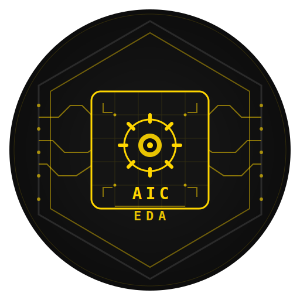

# AIC-EDA — 《终末地》集成工业自动布局EDA工具

<p align="center">
  
</p>

<p align="center">
  <strong>Automated Industry Complex — Electronic Design Automation</strong>
</p>

<p align="center">
  <a href="#"></a>
  <a href="#"></a>
  <a href="#"></a>
  <a href="#"></a>
</p>

> 为《明日方舟：终末地》集成工业系统（AIC）开发的 RTL 自动布局工具，将复杂的 3D 工厂布局问题转化为"芯片物理设计"问题。

---

## 目录

- [功能概览](#功能概览)
- [快速开始](#快速开始)
- [命名体系](#命名体系ic-design-类比)
- [项目结构](#项目结构)
- [核心算法](#核心算法)
- [构建指南](#构建指南)
- [常见问题](#常见问题)
- [路线图](#路线图)
- [许可证](#许可证)

---

## 功能概览

AIC-EDA 是一套面向终末地集成工业系统的电子设计自动化（EDA）风格工厂布局工具链。它将工厂规划问题抽象为 IC 物理设计的核心环节，提供从配方编译到蓝图导出的完整工作流。

### 主要功能

| 模块 | 功能描述 | 状态 |
|------|---------|------|
| **Recipe Browser** | 70+ 物品、80+ 配方的完整数据库浏览与搜索 | ✅ |
| **RTL Synthesis** | 从目标产物反向构建生产树，自动计算设备数量与产线平衡 | ✅ |
| **FloorPlan & Place** | 2D/3D 网格化设备布局，俄罗斯方块式网格对齐摆放 | ✅ |
| **Route-Fabric** | L 形曼哈顿传送带路由，A* 绕障寻路 | ✅ |
| **Throughput-STA** | 产能静态时序分析，瓶颈检测与松弛计算 | ✅ |
| **DRC-End** | 设计规则检查（间距、碰撞、电力覆盖、网格对齐） | ✅ |
| **PWR-Tree** | 供电树综合与优化 | ✅ |
| **Tape-Deploy** | 蓝图编码导出（GZip+Base64）与 JSON 可视化 | ✅ |

### 界面预览

<p align="center">
  <em>欢迎界面 → RTL 合成 → 布局预览 → 蓝图导出</em>
</p>

<!-- TODO: 添加实际截图 -->

---

## 快速开始

### 系统要求

- **操作系统**: Windows 10 版本 2004 (Build 19041) 或更高版本 / Windows 11
- **运行时**: .NET 8.0 Desktop Runtime
- **开发环境**: Visual Studio 2022 17.9+（推荐）或 VS Code + C# Dev Kit

### 安装与运行

```bash
# 克隆仓库
git clone https://github.com/CloverIris/AIC-EDA.git
cd AIC-EDA/AIC-EDA

# 还原依赖
dotnet restore

# 构建（必须指定 x64 或 x86 平台）
dotnet build -c Release -p:Platform=x64

# 运行
dotnet run -c Release -p:Platform=x64
```

### 基本工作流程

1. **Recipe Browser** — 浏览配方数据库，了解所需资源与加工链
2. **RTL Synthesis** — 选择目标产物（如「SC Wuling 电池」），输入目标产能，点击 **COMPILE**
3. **FloorPlan** — 查看自动生成的 2D 网格布局，拖拽平移、滚轮缩放，切换 40px/70px 网格
4. **Tape Deploy** — 导出蓝图字符串或 JSON 文件

---

## 命名体系（IC Design 类比）

终末地工业概念与 IC 设计概念的映射：

| 终末地工业概念 | 对应 IC 设计概念 | AIC-EDA 工具模块 |
|-------------|----------------|----------------|
| 配方 / 资源流 | RTL Design | **Recipe Compiler**（配方编译器） |
| 设施布局规划 | Floorplanning | **FloorPlan-EF**（布图规划器） |
| 设备 3D 摆放 | Placement | **Place & Belt**（布局与传送带） |
| 传送带路由 | Routing | **Route-Fabric**（传送布图） |
| 电力网络 | CTS + Power Grid | **PWR-Tree**（供电树综合） |
| 产能验证 | STA（静态时序分析） | **Throughput-STA**（产能静态分析） |
| 物理验证 | Physical Verification | **DRC-End**（设计规则检查） |
| 蓝图交付 | GDSII / Tape-out | **Tape-Deploy**（部署流片） |

---

## 项目结构

```
AIC-EDA/
├── App.xaml                    # 应用入口
├── MainWindow.xaml             # 主窗口 (MenuBar + Toolbar + NavigationView + Right Panel)
├── Themes/
│   └── EndfieldTheme.xaml      # 终末地暗色主题（柠檬黄主色调）
├── Controls/
│   └── BracketTag.xaml         # [ BRACKET_TAG ] 风格标签控件
├── Data/
│   └── Recipes.json            # 配方数据库（可外部更新）
├── Models/
│   ├── MachineType.cs          # 设备类型枚举（采矿/加工/物流/电力/农业）
│   ├── Item.cs                 # 物品定义与分类
│   ├── Recipe.cs               # 配方模型
│   ├── MachineSpec.cs          # 设备空间规格（宽×深×高、端口位置）
│   ├── ProductionNode.cs       # 生产节点
│   └── ProductionGraph.cs      # 生产依赖图
├── Core/                       # EDA 工具链核心
│   ├── RecipeCompiler.cs       # 配方编译器：反向构建生产树
│   ├── FlowBalancer.cs         # 流量平衡：设备数量计算与产线平衡
│   ├── SpatialPlanner.cs       # 空间布局：2D/3D 网格化 Placement
│   ├── RoutePlanner.cs         # 传送带路由：A* 曼哈顿路径规划
│   ├── ThroughputSTA.cs        # 产能静态时序分析
│   ├── DRCValidator.cs         # 设计规则检查引擎
│   ├── PWROptimizer.cs         # 供电树综合与优化
│   └── BlueprintCodec.cs       # 蓝图编解码器
├── Services/
│   └── RecipeDatabaseService.cs # 配方数据库服务（80+ 内置配方）
├── ViewModels/                 # MVVM ViewModels
└── Views/                      # WinUI 3 页面
    ├── WelcomeWindow.xaml      # 启动欢迎界面
    ├── RecipeBrowserPage.xaml  # 配方浏览器
    ├── RecipeCompilerPage.xaml # RTL 合成页面
    ├── LayoutPreviewPage.xaml  # 布局预览（2D/3D 网格渲染）
    └── BlueprintExportPage.xaml # 蓝图导出
```

---

## 核心算法

### 1. Recipe Compiler（配方编译器）

从目标产物反向递归构建生产依赖树。使用拓扑排序确定加工层级，自动识别并行加工路径与资源汇聚点。

### 2. Flow Balancer（流量平衡器）

根据目标产能与配方速率，计算每个节点的精确设备数量。支持：
- 下游需求汇总（Fan-in 聚合）
- 上游产能分配（Fan-out 分发）
- 瓶颈检测与松弛报告

### 3. Spatial Planner（空间布局规划器）

**2D 自动布局**：按拓扑层从左到右排列设备，同层设备从上到下堆叠，碰撞检测基于网格占用 HashSet。

**3D 分层布局**：将不同层级的设备分配到不同高度层，支持跨层垂直传送带规划。

**力导向优化**：弹簧-斥力模型减少传送带总长度，最后网格对齐到整数坐标。

### 4. Route Planner（传送布图）

基于 A* 算法的曼哈顿路径规划：
- 障碍物地图：标记所有设备占用的网格单元
- 绕障策略：X 方向优先，遇障尝试 Z 方向绕行
- 路径简化：去除共线中间点，保留转折点
- L 形可视化：传送带沿网格线走，转弯处标记黄色圆点

### 5. DRC-End（设计规则检查）

| 规则编号 | 检查项 | 描述 |
|---------|--------|------|
| DRC-001 | 设备间距检查 | 确保设备间最小安全距离 |
| DRC-002 | 传送带最大长度 | 验证 belt 长度不超过设备规格限制 |
| DRC-003 | 电力覆盖检查 | 验证所有设备在供电范围内 |
| DRC-004 | 碰撞检测 | 设备边界盒重叠检测 |
| DRC-005 | 网格对齐检查 | 确保设备坐标为网格整数倍 |
| DRC-006 | 输入输出连接检查 | 验证所有边都有有效端点 |

---

## 构建指南

详见 [`docs/build.md`](docs/build.md)。

### 快速构建

```bash
# Debug 模式
dotnet build -c Debug -p:Platform=x64

# Release 模式（发布）
dotnet build -c Release -p:Platform=x64

# 打包 MSIX
dotnet publish -c Release -p:Platform=x64 -p:PublishProfile=Properties\PublishProfiles\win10-x64.pubxml
```

### 已知问题

**WinAppSDK 1.8 XamlCompiler 崩溃**
- **症状**: `XamlCompiler.exe` 返回 exit code 1
- **根因**: Windows App SDK 1.8 的 XamlCompiler 在特定条件下崩溃（GitHub Issue #10947）
- **解决方案**: 使用 Visual Studio 构建而非命令行 `dotnet build`，或降级到 WinAppSDK 1.6.x/1.7.x

**PRI/XBF 扁平化崩溃**
- **症状**: 当 Views/ 子文件夹中存在同名 XAML 文件时编译失败
- **解决方案**: 项目已配置 `<Page Update="Views\**\*.xaml"><Link>%(Filename)%(Extension)</Link></Link>`  workaround

---

## 常见问题

**Q: 为什么必须指定 x64/x86 平台？**
> WinUI 3 打包应用不支持 AnyCPU。项目已配置 `<Platforms>x86;x64;ARM64</Platforms>`。

**Q: 配方数据准确吗？**
> 配方数据基于 game8.co、endfielddb.com 和 endfield.wiki.gg 的公开资料整理，可能与游戏实际版本存在差异。

**Q: 蓝图能直接导入游戏吗？**
> 目前蓝图格式为自定义 GZip+Base64 编码，游戏原生格式尚未逆向。导出数据可用于参考和手动复现。

**Q: 支持 macOS/Linux 吗？**
> 暂不支持。WinUI 3 是 Windows 专属框架。

---

## 路线图

### Phase 1: 前端综合（Recipe Compiler）✅
- [x] 配方数据库（70+ 物品，80+ 配方）
- [x] 产线平衡算法
- [x] Machine Netlist 输出

### Phase 2: 后端布局布线（Place & Belt）✅
- [x] 2D/3D 网格系统与碰撞检测
- [x] 基础 Placement 算法
- [x] Belt Routing（A* 寻路）
- [x] 网格铺满渲染

### Phase 3: 物理实现（PWR-Tree & DRC）✅
- [x] 供能器优化算法
- [x] DRC 规则引擎
- [x] 2D 可视化预览

### Phase 4: 签核与流片（Sign-off & Tape-Deploy）✅
- [x] Throughput-STA 引擎
- [x] 蓝图编码器
- [x] JSON 导出

### Phase 5: 进阶优化（Future）
- [ ] 游戏内原生蓝图格式支持（需逆向）
- [ ] 3D 预览（DirectX 硬件加速渲染）
- [ ] 电力网络可视化覆盖
- [ ] 多产物联合优化
- [ ] 自动流水线节拍平衡

---

## 致谢

- 配方数据来源：[game8.co](https://game8.co)、[endfielddb.com](https://endfielddb.com)、[endfield.wiki.gg](https://endfield.wiki.gg)
- 游戏资产版权归 **GRYPHLINE** / 鹰角网络所有
- 本项目为社区驱动的非官方工具，与开发商无任何关联

---

## 许可证

[MIT License](LICENSE)

社区驱动项目，与鹰角网络 / GRYPHLINE 无任何官方关联。游戏资产归 GRYPHLINE 所有。
